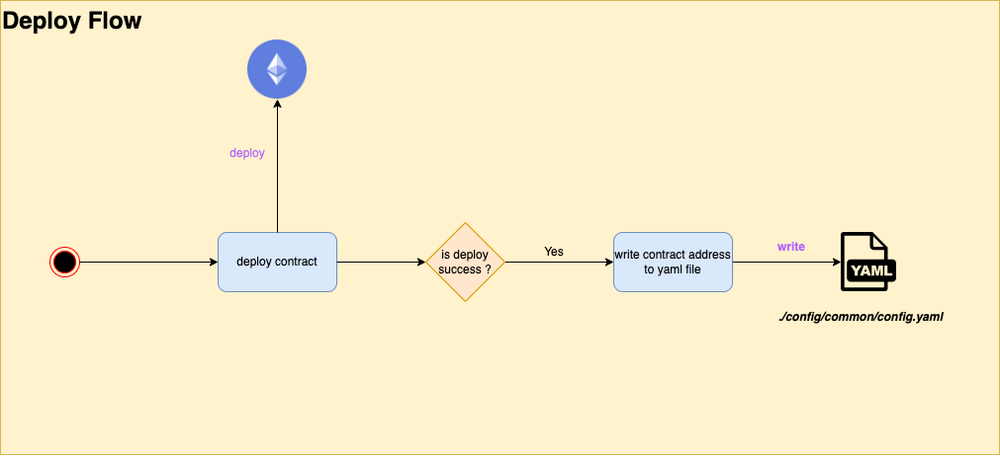
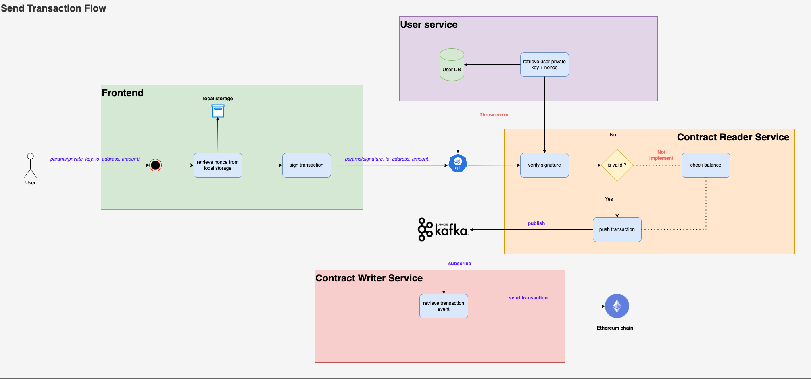

# Prerequisites
Before you start, make sure that you have the following software installed on your computer:

* [Go programming language](https://go.dev/dl/) (version `1.22` or later)
* [Docker](https://www.docker.com/) version `25.0.2` or later
* [Make](https://www.gnu.org/software/make/manual/make.html) `3.81` or later

# Workloads
## Blockchain Consensus Algorithm
Using this command for interact with blockchain algorithm. 

```sh
  make start-blockchain-algorithm # for interact with blockchain algorithm
```

## Blockchain Interaction
First of all, run build docker image:
```sh
  make docker-build
```

To start all services required for your web application, including those that handle blockchain interactions, run the following command:

```sh
  make start-all 
```

## Smart Contract Deployment
1. First, retrieve an account's private key by running the following command:
```sh
  make get-accounts
```
This command will output one or more private keys. Note the key you intend to use for deployment.

2. You will need to remove the first two characters (**0x**) from the hexadecimal representation of the private key. Here’s an example:
```sh
# Before: 0x822394ad1caf8ec4bf4e9406a6952f62ec6b787d2086b9c45c8b2f0e44ba5dfc
# After: 822394ad1caf8ec4bf4e9406a6952f62ec6b787d2086b9c45c8b2f0e44ba5dfc
```
3. Replace the private_key field in `./config/common/config.yaml` with the formatted private key from the previous step. Your config.yaml should look something like this:
```sh
# ./config/common/config.yaml
blockchain:
  private_key: "822394ad1caf8ec4bf4e9406a6952f62ec6b787d2086b9c45c8b2f0e44ba5dfc"
  # other configuration settings

```

4. To deploy the **MyToken** smart contract, use the following command:
This command will compile and deploy the MyToken contract to ganache network.

```sh
  make deploy-contract # deploy contract
```

## Web Application Development
After you start all services, the frontend UI already serve in http://localhost:9999 by default.

## Security Considerations:

- [ ]  Implement multi-factor authentication (MFA) for accessing the server and its APIs.
- [ ] [RBAC](https://en.wikipedia.org/wiki/Role-based_access_control): Define and enforce roles and permissions to ensure users only have access to the functionalities they need.
- [ ] Use HTTPS to encrypt data in transit between clients and the server.
- [ ]  Implement rate limiting to protect against DDoS attacks and abuse of API endpoints.
- [ ] Implement real-time monitoring and alerting to detect and respond to suspicious activities promptly (using `prometheus`).
- [ ] Secure private keys using hardware security modules (HSMs) or secure enclaves. Never hardcode private keys in the source code.
- [ ] Configure firewalls to limit access to the server and protect against unauthorized access.
- [ ] Perform regular backups of critical data and configuration files.
- [ ] Integration tests aim to verify that different components of a system can work together correctly as a whole

## Optimization and Scalability
- [ ] Implement caching strategies (e.g., Redis, Memcached) to store frequently accessed data and reduce database load.
- [ ] **Horizontal Scaling** Add more instances of (**gateway**, **user**, **contract_reader**, **contract_writer** services) to distribute the load (ex: Kubernetes).
- [ ] **Vertical Scaling**: Increase the resources (CPU, memory) of **watcher service** to handle more load.

## Documentation
My project is built on a cutting-edge microservice architecture, utilizing a mono-repo implementation combined with advanced patterns like CQRS, Event Sourcing, and Domain-Driven Design. This approach ensures a robust, scalable, and maintainable system capable of meeting complex business requirements efficiently.\
**Reference docs**:
- [Microservice](https://microservices.io/patterns/microservices.html).
- [CQRS](https://microservices.io/patterns/data/cqrs.html).
- [Event-sourcing](https://microservices.io/patterns/data/event-sourcing.html).
- [Event Driven Design](https://en.wikipedia.org/wiki/Event-driven_architecture).

Structure folder I follow [Go project layout standard](https://github.com/golang-standards/project-layout). \
Coding style I follow [Go effective](https://github.com/golang-standards/project-layout) and [Go Uber Style](https://github.com/uber-go/guide/blob/master/style.md).
### Architecture


## Services Overview

### ⭐ Gateway Service
The Gateway Service acts as a reverse proxy, routing client requests to the appropriate backend services. It consolidates all API calls, ensuring secure and efficient communication between the client and the microservices.

### ⭐ User Management Service
The User Management Service handles user authentication and authorization. It manages user data, registration, login, and access control, ensuring secure user interactions across the platform.

### ⭐ Contract Writer Service
The Contract Writer Service is responsible for sending commands to the Ethereum blockchain and updating the associated database. It facilitates the creation and updating of smart contracts, ensuring that all write operations are executed correctly on the blockchain and reflected in the database.

### ⭐ Contract Reader Service
The Contract Reader Service retrieves data from both the Ethereum blockchain and the database. It reads smart contract states, transaction details, and other blockchain information, providing accurate and up-to-date data to other services. Additionally, it ensures synchronization between blockchain data and the database by updating database records as needed.

### ⭐ Watcher Service
The Watcher Service monitors event logs from the Ethereum blockchain. It listens for specific events, triggers notifications or actions in response to these events, and ensures that the system reacts promptly to changes on the blockchain.

### Some Important flows
Deploy Flow

Send Transaction Flow


### Structure folder:
```
.
├── LICENSE                     # License file for the project
├── Makefile                    # Makefile for automating tasks and commands
├── README.md                   # Project's README file with overview and instructions
├── api                         # Directory for API definitions and smart contract sources
│   ├── protos                  # Protocol buffer definitions
│   │   ├── common
│   │   │   └── common.proto    # Common protobuf definitions shared across services
│   │   ├── contract
│   │   │   └── contract_reader.proto # Protobuf for contract reader service
│   │   └── user
│   │       ├── auth.proto      # Protobuf for authentication service
│   │       └── user.proto      # Protobuf for user management service
│   └── sols                    # Solidity smart contract sources
│       ├── ERC20.sol           # ERC20 token contract source
│       ├── IERC20.sol          # ERC20 interface source
│       └── MyToken.sol         # Custom token contract source
├── cmd                         # Main entry points for different services
│   ├── contractReader.go       # Entry point for the contract reader service
│   ├── contractWriter.go       # Entry point for the contract writer service
│   ├── deployContract.go       # Entry point for the contract deployment service
│   ├── frontend.go             # Entry point for the frontend service
│   ├── gateway.go              # Entry point for the gateway service
│   ├── root.go                 # Root command definition
│   ├── srv                     # Service-specific main files
│   │   ├── contract_reader
│   │   │   └── srv.go          # Main file for the contract reader service
│   │   ├── contract_writer
│   │   │   └── srv.go          # Main file for the contract writer service
│   │   ├── deploy_contract
│   │   │   └── srv.go          # Main file for the deploy contract service
│   │   ├── frontend
│   │   │   └── srv.go          # Main file for the frontend service
│   │   ├── gateway
│   │   │   └── srv.go          # Main file for the gateway service
│   │   ├── user
│   │   │   └── srv.go          # Main file for the user management service
│   │   └── watcher
│   │       └── srv.go          # Main file for the watcher service
│   ├── user.go                 # Entry point for the user management service
│   └── watcher.go              # Entry point for the watcher service
├── config                      # Configuration files for different services
│   ├── address.go              # Common address configuration
│   ├── common
│   │   └── config.yaml         # Common configuration file
│   ├── config.go               # Configuration setup
│   ├── contract_reader
│   │   └── config.yaml         # Configuration for contract reader service
│   ├── contract_writer
│   │   └── config.yaml         # Configuration for contract writer service
│   ├── database.go             # Database configuration
│   ├── deploy_contract
│   │   └── config.yaml         # Configuration for deploy contract service
│   ├── frontend
│   │   └── config.yaml         # Configuration for frontend service
│   ├── gateway
│   │   └── config.yaml         # Configuration for gateway service
│   ├── user
│   │   └── config.yaml         # Configuration for user management service
│   └── watcher
│       └── config.yaml         # Configuration for watcher service
├── developments                # Development environment setup files
│   ├── Dockerfile              # Dockerfile for building the development environment
│   ├── docker-compose.all.yml  # Docker Compose file to start all services
│   ├── docker-compose.gen.yml  # Docker Compose file for generating files
│   ├── docker-compose.yml      # Docker Compose file for standard setup
│   ├── ganache_data            # Directory for Ganache blockchain data
│   ├── gen-proto.sh            # Script to generate protobuf files
│   ├── gen-sol.sh              # Script to generate Solidity files
│   ├── proto.Dockerfile        # Dockerfile for protobuf generation
│   └── sol.Dockerfile          # Dockerfile for Solidity contract generation
├── docs                        # Documentation files
│   ├── swagger                 # Swagger API documentation
│   │   ├── blockchain
│   │   │   └── blockchain.swagger.json # Swagger doc for blockchain APIs
│   │   ├── common
│   │   │   └── common.swagger.json     # Swagger doc for common APIs
│   │   ├── contract
│   │   │   └── contract_reader.swagger.json # Swagger doc for contract reader API
│   │   └── user
│   │       ├── auth.swagger.json       # Swagger doc for auth API
│   │       └── user.swagger.json       # Swagger doc for user
│   └── wiki
│       └── blockchain_architechture.png # Diagram of blockchain architecture
├── go.mod                      # Go module file
├── go.sum                      # Go module dependencies file
├── html                        # Directory for UI presentation files
├── idl                         # Interface Definition Language files
│   ├── contracts               # ABI and binary files for contracts
│   │   ├── ERC20.abi
│   │   ├── ERC20.bin
│   │   ├── ERC20.go
│   │   ├── IERC20.abi
│   │   ├── IERC20.bin
│   │   ├── IERC20.go
│   │   ├── MyToken.abi
│   │   ├── MyToken.bin
│   │   └── MyToken.go
│   └── pb                      # Generated protobuf Go files
│       ├── common
│       │   ├── common.pb.go
│       │   └── common.pb.validate.go
│       ├── contract
│       │   ├── contract_reader.pb.go
│       │   ├── contract_reader.pb.gw.go
│       │   ├── contract_reader.pb.validate.go
│       │   └── contract_reader_grpc.pb.go
│       └── user
│           ├── auth.pb.go
│           ├── auth.pb.gw.go
│           ├── auth.pb.validate.go
│           ├── auth_grpc.pb.go
│           ├── user.pb.go
│           ├── user.pb.gw.go
│           ├── user.pb.validate.go
│           └── user_grpc.pb.go
├── internal                    # Internal package for core business logic
│   ├── blockchain
│   │   └── watcher
│   │       └── watcher.go      # Blockchain watcher implementation
│   ├── contract
│   │   ├── entities
│   │   │   ├── approval.go
│   │   │   └── transfer.go
│   │   ├── repositories
│   │   │   ├── approval.go
│   │   │   ├── blockchain.go
│   │   │   ├── eth
│   │   │   │   ├── blockchain.go
│   │   │   │   └── my_token.go
│   │   │   ├── mongo
│   │   │   │   ├── approval.go
│   │   │   │   └── transfer.go
│   │   │   ├── my_token.go
│   │   │   └── transfer.go
│   │   └── services
│   │       ├── contract_reader.go
│   │       ├── contract_writer.go
│   │       └── deploy.go
│   └── user-mgnt
│       ├── entities
│       │   └── user.go
│       ├── repositories
│       │   ├── mongo
│       │   │   └── user.go
│       │   └── user.go
│       └── services
│           ├── auth.go
│           ├── auth_test.go
│           └── user.go
├── main.go                     # Main entry point for the application
├── pkg                         # Package directory for reusable components
│   ├── blockchain              # Blockchain-related utilities and components
│   │   ├── block
│   │   │   └── block.go        # Implementation of blockchain blocks
│   │   ├── blockchain.go       # Core blockchain logic
│   │   ├── miner
│   │   │   └── miner.go        # Miner implementation
│   │   └── pow
│   │       ├── pow.go          # Proof-of-work algorithm implementation
│   │       └── pow_test.go     # Tests for proof-of-work implementation
│   ├── constants               # Common constants used across
│   │   └── constants.go        # Definition of constants
│   ├── eth_client              # Ethereum client implementations
│   │   ├── client.go           # Base Ethereum client
│   │   ├── dial_client.go      # Ethereum client that dials a real node
│   │   └── simulated_client.go # Ethereum client for simulated blockchain environments
│   ├── grpc_client             # gRPC client implementations
│   │   └── client.go           # Base gRPC client
│   ├── grpc_server             # gRPC server implementations
│   │   ├── grpc.go             # Base gRPC server setup
│   │   └── health_check.go     # Health check implementation for gRPC server
│   ├── http_server             # HTTP server implementations
│   │   ├── http.go             # Base HTTP server setup
│   │   ├── middleware.go       # Middleware components for HTTP server
│   │   └── utils.go            # Utility functions for HTTP server
│   ├── iface                   # Interface definitions for various components
│   │   ├── processor
│   │   │   ├── processor.go    # Processor interface definition
│   │   │   └── service.go      # Service interface definition
│   │   └── pubsub              # Publish-subscribe interface definitions
│   │       ├── model.go        # Models for pub-sub
│   │       ├── publisher.go    # Publisher interface
│   │       └── subscriber.go   # Subscriber interface
│   ├── kafka                   # Kafka publisher and subscriber implementations
│   │   ├── handler.go          # Kafka message handler
│   │   ├── publisher.go        # Kafka publisher implementation
│   │   └── subscriber.go       # Kafka subscriber implementation
│   ├── metadata                # Metadata utilities
│   │   └── metadata.go         # Metadata handling functions
│   ├── mongo_client            # MongoDB client implementation
│   │   └── client.go           # Base MongoDB client setup
   └── xerror                  # Extended error handling utilities
│       └── xerror.go           # Custom error types and handling functions
├── tests                       # Testing suite for various components
│   ├── blockchain
│   │   └── main.go             # Main test suite for blockchain components
│   ├── kafka
│   │   ├── publisher
│   │   │   └── main.go         # Test suite for Kafka publisher
│   │   └── subscriber
│   │       └── main.go         # Test suite for Kafka subscriber
│   ├── layer1
│   │   └── ganache
│   │       └── main.go         # Test suite for Layer 1 blockchain using Ganache
│   └── mongo
│       └── main.go             # Test suite for MongoDB integration
└── util                        # Utility functions
    ├── convert.go              # Data conversion utilities
    ├── crypto.go               # Cryptographic utilities
    ├── eth_util                # Ethereum-specific utilities
    │   ├── util.go             # General Ethereum utilities
    │   └── util_test.go        # Tests for Ethereum utilities
    ├── hash_sha256.go          # SHA-256 hashing utility
    ├── jwt.go                  # JSON Web Token (JWT) utilities
    └── password.go             # Password hashing and validation utilities


89 directories, 180 files
```

