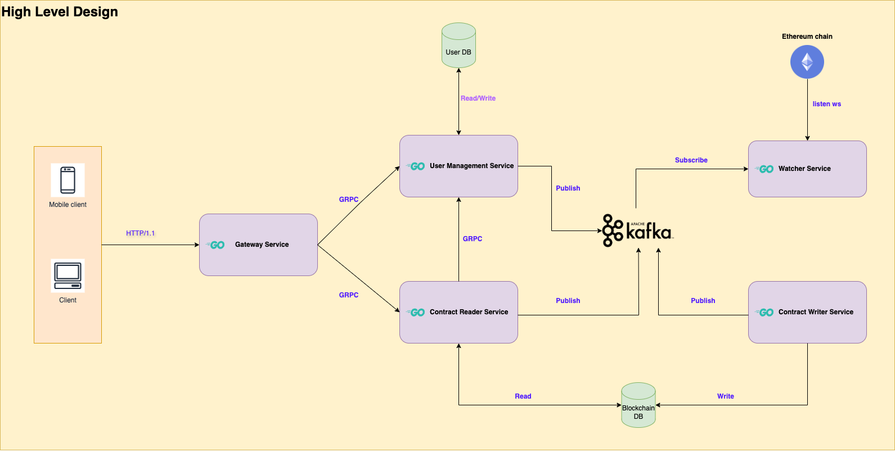

# Prerequisites
Before you start, make sure that you have the following software installed on your computer:

* Go programming language (version 1.22 or later)
* Git version control system
* Docker version 25.0.2 or later
* Make 3.81 or later

# Tasks
## Blockchain Consensus Algorithm
Using this command for interact with blockchain algorithm. 

```sh
  make start-blockchain-algorithm # for interact with blockchain algorithm
```

## Blockchain Interaction
Using this command for start all service that serve for web application. It is also include Blockchain interaction.

```sh
  make start-all # start all services that serve for blockchain interact with algorithm
```
## Smart Contract Deployment
Using this command for deploy contract (deploy **MyToken** contract).

```sh
  make deploy-contract # deploy contract
```
## Web Application Development
After you start all services, the frontend UI already serve in http://localhost:9999 by default.

## Security Considerations:

- [x] Transfer using signature instead of sending private key through http/https.
- [] Improve web application protocol using SSL (https).
- [] Improve using SSL for grpc protocol for each servers.
- [] Split private key of user into more part and store each part in more place.

## Optimization and Scalability

- [x] Split contract service(responsible for contract implementation) into 2 service(contract_reader, contract_writer).
- [x] Implement new watcher service that subscribe to websocket of ethereum chain and publish message to message queue.
- [] Improve send transaction handler with multi-instance can serve. 
- [] Improve to multi watcher (currently, only one watcher subscribe to event logs).

## Documentation

### Architecture



#### Description ✍️: 
⭐ **Gateway service**: Responsible to deliver all apis to services using reverse proxy. \
⭐ **User management service**: Responsible to auth/user management. \
⭐ **Contract writer service**: Responsible to write command for contract or ethereum chain information. \
⭐ **Contract reader service**: Responsible to read command for contract or ethereum chain information. \
⭐ **Watcher service**: Responsible to watch event logs from ethereum chain.

### Structure folder:
```
.
├── LICENSE
├── Makefile
├── README.md
├── api
│   ├── protos
│   │   ├── common
│   │   │   └── common.proto
│   │   ├── contract
│   │   │   └── contract_reader.proto
│   │   └── user
│   │       ├── auth.proto
│   │       └── user.proto
│   └── sols
│       ├── ERC20.sol
│       ├── IERC20.sol
│       └── MyToken.sol
├── cmd
│   ├── contractReader.go
│   ├── contractWriter.go
│   ├── deployContract.go
│   ├── frontend.go
│   ├── gateway.go
│   ├── root.go
│   ├── srv
│   │   ├── contract_reader
│   │   │   └── srv.go
│   │   ├── contract_writer
│   │   │   └── srv.go
│   │   ├── deploy_contract
│   │   │   └── srv.go
│   │   ├── frontend
│   │   │   └── srv.go
│   │   ├── gateway
│   │   │   └── srv.go
│   │   ├── user
│   │   │   └── srv.go
│   │   └── watcher
│   │       └── srv.go
│   ├── user.go
│   └── watcher.go
├── config
│   ├── address.go
│   ├── common
│   │   └── config.yaml
│   ├── config.go
│   ├── contract_reader
│   │   └── config.yaml
│   ├── contract_writer
│   │   └── config.yaml
│   ├── database.go
│   ├── deploy_contract
│   │   └── config.yaml
│   ├── frontend
│   │   └── config.yaml
│   ├── gateway
│   │   └── config.yaml
│   ├── user
│   │   └── config.yaml
│   └── watcher
│       └── config.yaml
├── developments
│   ├── Dockerfile
│   ├── docker-compose.all.yml
│   ├── docker-compose.gen.yml
│   ├── docker-compose.yml
│   ├── ganache_data
│   ├── gen-proto.sh
│   ├── gen-sol.sh
│   ├── proto.Dockerfile
│   └── sol.Dockerfile
├── docs
│   ├── swagger
│   │   ├── blockchain
│   │   │   └── blockchain.swagger.json
│   │   ├── common
│   │   │   └── common.swagger.json
│   │   ├── contract
│   │   │   └── contract_reader.swagger.json
│   │   └── user
│   │       ├── auth.swagger.json
│   │       └── user.swagger.json
│   └── wiki
│       └── blockchain_architechture.png
├── go.mod
├── go.sum
├── html # presentation for UI.
├── idl
│   ├── contracts
│   │   ├── ERC20.abi
│   │   ├── ERC20.bin
│   │   ├── ERC20.go
│   │   ├── IERC20.abi
│   │   ├── IERC20.bin
│   │   ├── IERC20.go
│   │   ├── MyToken.abi
│   │   ├── MyToken.bin
│   │   └── MyToken.go
│   └── pb
│       ├── common
│       │   ├── common.pb.go
│       │   └── common.pb.validate.go
│       ├── contract
│       │   ├── contract_reader.pb.go
│       │   ├── contract_reader.pb.gw.go
│       │   ├── contract_reader.pb.validate.go
│       │   └── contract_reader_grpc.pb.go
│       └── user
│           ├── auth.pb.go
│           ├── auth.pb.gw.go
│           ├── auth.pb.validate.go
│           ├── auth_grpc.pb.go
│           ├── user.pb.go
│           ├── user.pb.gw.go
│           ├── user.pb.validate.go
│           └── user_grpc.pb.go
├── internal
│   ├── blockchain
│   │   └── watcher
│   │       └── watcher.go
│   ├── contract
│   │   ├── entities
│   │   │   ├── approval.go
│   │   │   └── transfer.go
│   │   ├── repositories
│   │   │   ├── approval.go
│   │   │   ├── blockchain.go
│   │   │   ├── eth
│   │   │   │   ├── blockchain.go
│   │   │   │   └── my_token.go
│   │   │   ├── mongo
│   │   │   │   ├── approval.go
│   │   │   │   └── transfer.go
│   │   │   ├── my_token.go
│   │   │   └── transfer.go
│   │   └── services
│   │       ├── contract_reader.go
│   │       ├── contract_writer.go
│   │       └── deploy.go
│   └── user-mgnt
│       ├── entities
│       │   └── user.go
│       ├── repositories
│       │   ├── mongo
│       │   │   └── user.go
│       │   └── user.go
│       └── services
│           ├── auth.go
│           ├── auth_test.go
│           └── user.go
├── main.go
├── pkg
│   ├── blockchain
│   │   ├── block
│   │   │   └── block.go
│   │   ├── blockchain.go
│   │   ├── miner
│   │   │   └── miner.go
│   │   └── pow
│   │       ├── pow.go
│   │       └── pow_test.go
│   ├── constants
│   │   └── constants.go
│   ├── eth_client
│   │   ├── client.go
│   │   ├── dial_client.go
│   │   └── simulated_client.go
│   ├── grpc_client
│   │   └── client.go
│   ├── grpc_server
│   │   ├── grpc.go
│   │   └── health_check.go
│   ├── http_server
│   │   ├── http.go
│   │   ├── middleware.go
│   │   └── utils.go
│   ├── iface
│   │   ├── processor
│   │   │   ├── processor.go
│   │   │   └── service.go
│   │   └── pubsub
│   │       ├── model.go
│   │       ├── publisher.go
│   │       └── subscriber.go
│   ├── kafka
│   │   ├── handler.go
│   │   ├── publisher.go
│   │   └── subscriber.go
│   ├── metadata
│   │   └── metadata.go
│   ├── mongo_client
│   │   └── client.go
│   └── xerror
│       └── xerror.go
├── tests
│   ├── blockchain
│   │   └── main.go
│   ├── kafka
│   │   ├── publisher
│   │   │   └── main.go
│   │   └── subscriber
│   │       └── main.go
│   ├── layer1
│   │   └── ganache
│   │       └── main.go
│   └── mongo
│       └── main.go
└── util
    ├── convert.go
    ├── crypto.go
    ├── eth_util
    │   ├── util.go
    │   └── util_test.go
    ├── hash_sha256.go
    ├── jwt.go
    └── password.go

89 directories, 180 files
```

